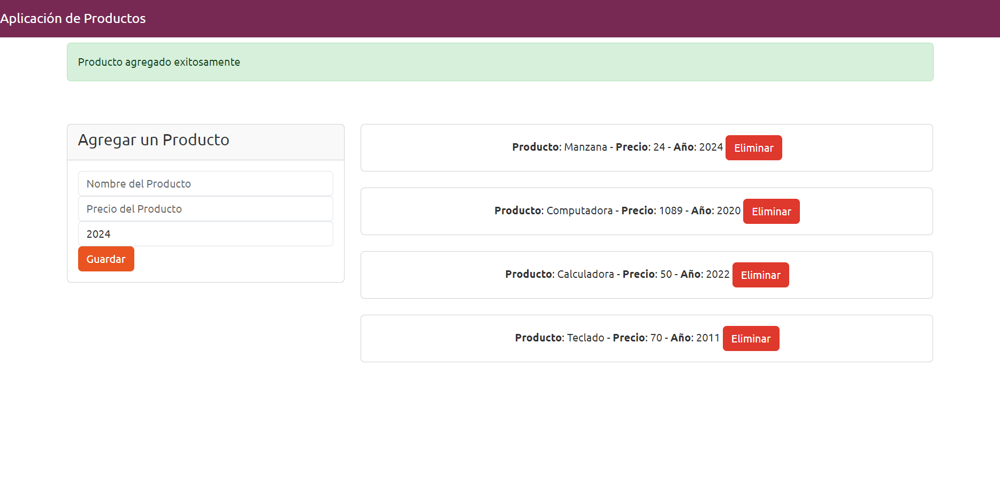

# Aplicación de Productos con JavaScript

Esta es una aplicación simple de CRUD (Crear, Leer, Actualizar, Eliminar) en el frontend usando JavaScript vanilla y Programación Orientada a Objetos (OOP) con características de Ecmascript 6+.



# Instalación

```
npm install
npm start
```

ahora visita http://localhost:8080

# Estructura del Proyecto

- `src` es la carpeta con el código fuente
